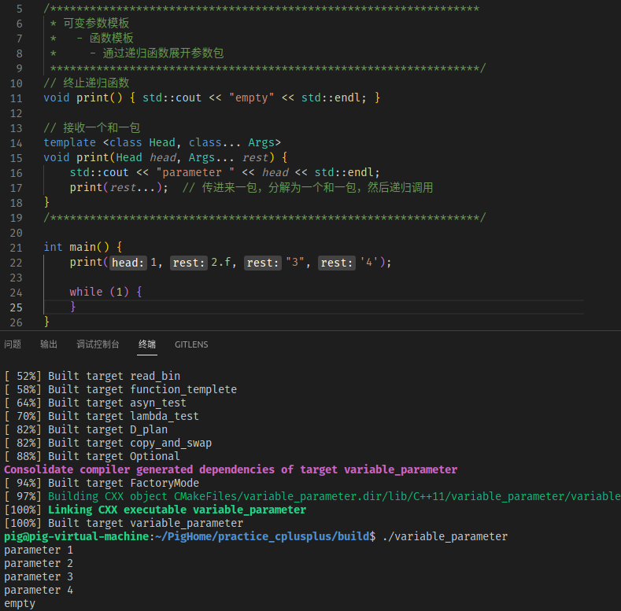

# c++11新特性之可变模板参数

c++11新增的可变模板参数特性，对参数进行了高度泛化，它能传递<font color=#008000 size=4> ***任意个数任意类型*** </font>的数据给到函数模板/类模板。

## 函数模板

可变参数模板和普通模板的语义一样，只是写法上稍有差别，声明可变参数模板时，需要在typename或class后面带上省略号"..."，一个典型的可变参函数模板如下：

``` cpp
template<class... T>
void f(T... args)
{
    cout << sizeof...(args) << endl;
}

f ();          // 0
f (1,2);       // 2
f (1,2.f,"3"); // 3 
```

省略号作用有两个：
1. 声明一个参数包 T... args，这个参数包中可以包含0到任意个模板参数
2. 在模板定义的右边，可以将参数包展开成一个一个独立的参数

### 可变参数展开

可以使用递归函数方式展开参数包，也可以使用逗号表达式展开参数包。

#### 使用递归函数方式展开

递归函数方式比较好理解，但是必须要冲在一个递归终止函数，即必须要有一个同名的终止函数来终止递归！

``` cpp
/*****************************************************************
 * 可变参数模板
 *   - 函数模板
 *     - 通过递归函数展开参数包（求和）
 *****************************************************************/
// 终止递归函数
template <class Args>
void print(Args args) {
    std::cout << "parameter " << args << std::endl;
}

// 接收一个和一包
template <class Head, class... Args>
void print(Head head, Args... rest) {
    std::cout << "parameter " << head << std::endl;
    print(rest...);  // 传进来一包，分解为一个和一包，然后递归调用
}
/*****************************************************************/
/*****************************************************************
 * 可变参数模板
 *   - 函数模板
 *     - 通过递归函数展开参数包(求和)
 *****************************************************************/
// 终止递归函数
template <class T>
T sum(T head) {
    return head;
}

// 接收一个和一包
template <class T, class... Args>
T sum(T head, Args... args) {
    return head + sum<T>(args...);
}
```



#### 使用逗号表达式展开包

逗号表达式简介：
    <font color=#660066 size=4> ***d = (a = b , c);*** </font>
    
因为逗号的优先级比等号低，所以上面例子会先执行 -> a = b ，然后在把c的结果赋值给d，即先执行 a = b，在执行 d = c 
expand函数中的逗号表达式：
    (printarg(args,0))，也是按照这个顺序


